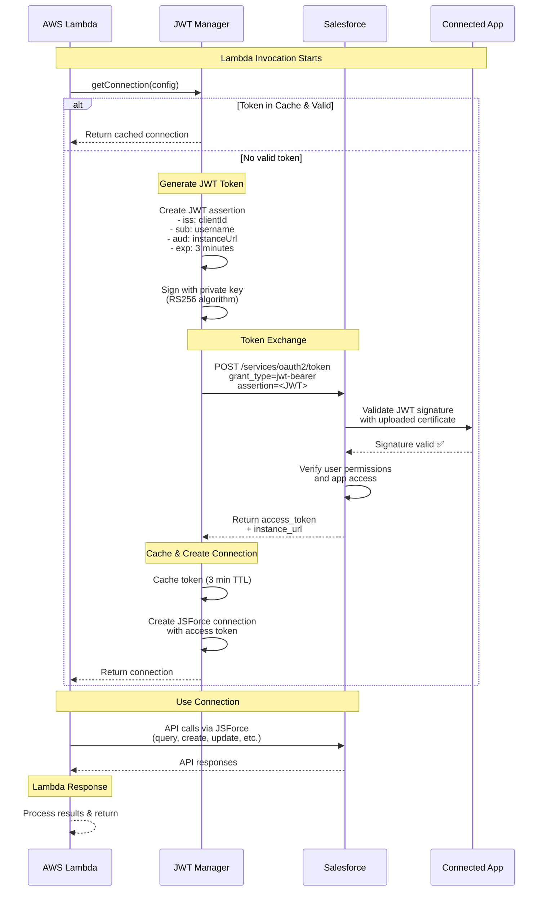
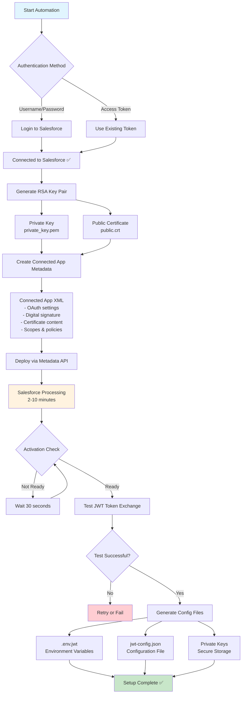
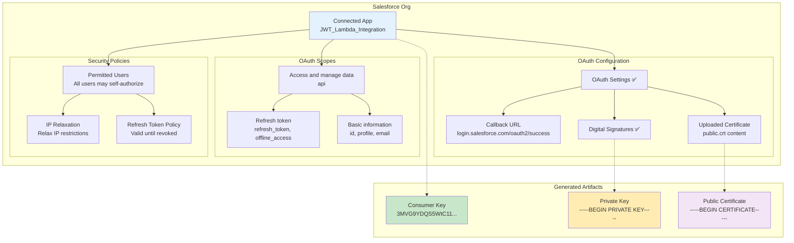
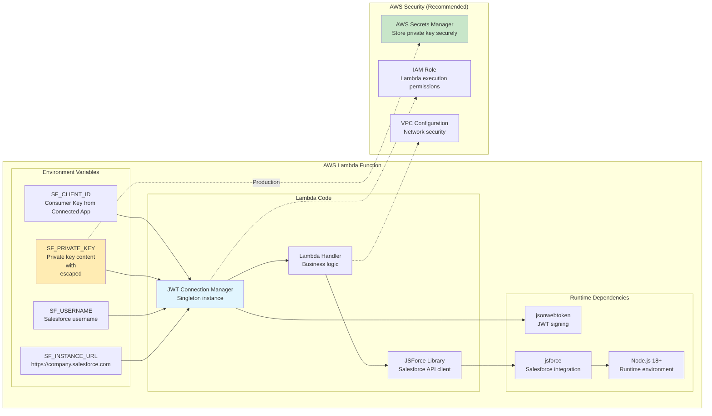
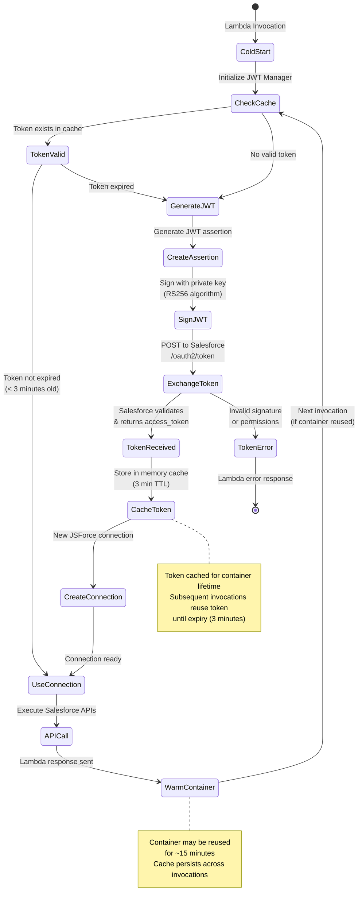
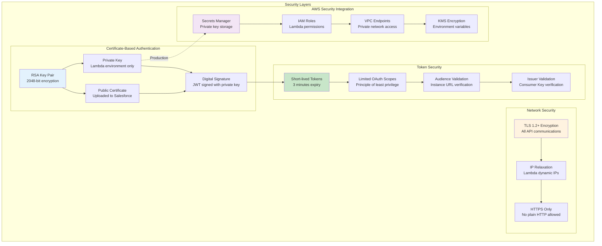
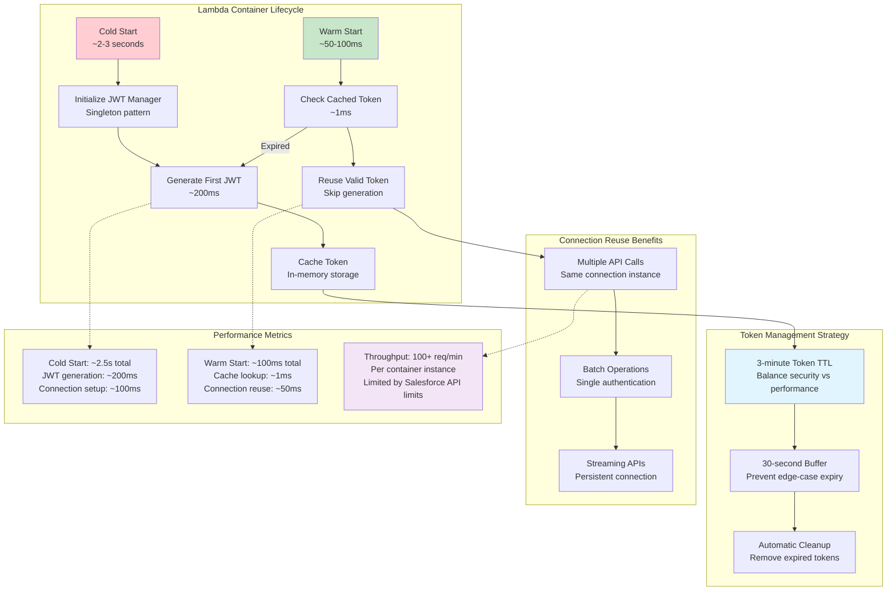
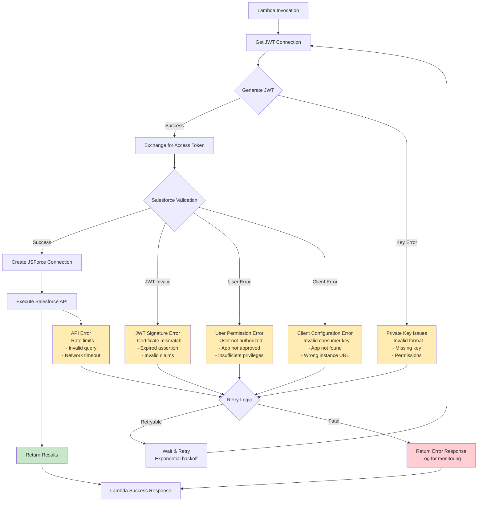
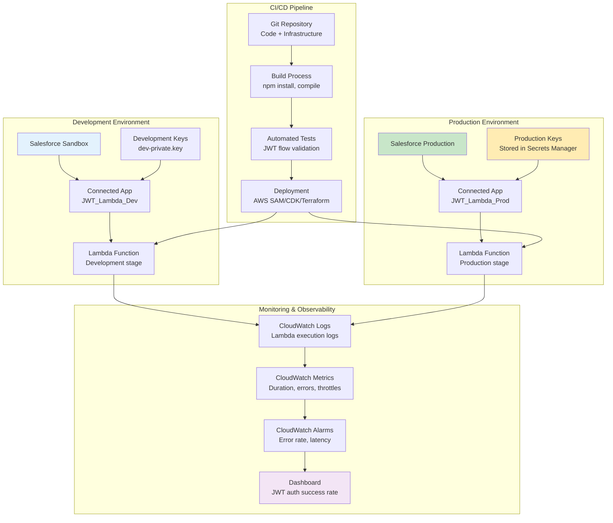

# JWT Bearer Token Flow - Visual Diagrams

This document provides comprehensive Mermaid diagrams showing how JWT Bearer Token Flow works with Salesforce and AWS Lambda.

## 1. Complete JWT Authentication Flow

## 2. Automation Setup Process

## 3. What Gets Created in Salesforce

## 4. Lambda Environment Setup

## 5. JWT Token Lifecycle in Lambda

## 6. Security Architecture

## 7. Performance Optimization Flow

## 8. Error Handling & Recovery

## 9. Deployment Architecture

## Summary

These diagrams illustrate:

1. **JWT Authentication Flow**: Complete sequence from Lambda invocation to Salesforce API calls
2. **Automation Process**: How the setup script creates everything automatically
3. **Salesforce Configuration**: What gets created in your Salesforce org
4. **Lambda Setup**: Required environment variables and dependencies
5. **Token Lifecycle**: How tokens are generated, cached, and reused
6. **Security Architecture**: Multi-layered security approach
7. **Performance Optimization**: Caching strategy and container reuse
8. **Error Handling**: Comprehensive error scenarios and recovery
9. **Deployment Architecture**: Development to production pipeline

The JWT Bearer Token Flow provides a secure, performant, and scalable solution for Salesforce integration in AWS Lambda environments.